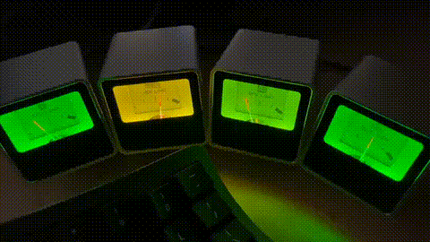

# nix-vudials

*This README was written by AI (Deepseek v4 Pro). I apologize for any shortcomings.*



Nix flake providing packages and a service module for [VU dials](https://github.com/SasaKaranovic/VU-Server) — USB-connected analog gauges that display system metrics.

Contains:
- `vuserver` — the dial control server (wraps upstream [VU-Server](https://github.com/SasaKaranovic/VU-Server))
- `vuclient` — cross-platform system monitor that pushes CPU, GPU, memory, and disk usage to the server
- A single NixOS/darwin module that configures both services

Works on macOS (launchd) and NixOS (systemd).

## Usage

Add to your flake inputs:
```nix
inputs.vudials.url = "github:bonds/nix-vudials";
```

### nix-darwin (macOS)
```nix
darwinConfigurations."hostname" = nix-darwin.lib.darwinSystem {
  specialArgs = let
    pkgs = import inputs.nixpkgs { system = "aarch64-darwin"; };
  in {
    inherit (inputs) self;
    vuclient = pkgs.callPackage "${inputs.vudials}/pkgs/vuclient" {};
    vuserver = pkgs.callPackage "${inputs.vudials}/pkgs/vuserver" {};
  };
  modules = [
    inputs.vudials.darwinModules.default
    {
      services.vudials.enable = true;
      services.vudials.device = "/dev/cu.usbserial-YOURSERIAL";
      services.vudials.cpudial = "UID1";
      services.vudials.gpudial = "UID2";
      services.vudials.memdial = "UID3";
      services.vudials.dskdial = "UID4";
    }
  ];
};
```

### NixOS
```nix
nixosConfigurations."hostname" = inputs.nixpkgs.lib.nixosSystem {
  specialArgs = let
    pkgs = import inputs.nixpkgs { system = "x86_64-linux"; };
  in {
    vuclient = pkgs.callPackage "${inputs.vudials}/pkgs/vuclient" {};
    vuserver = pkgs.callPackage "${inputs.vudials}/pkgs/vuserver" {};
  };
  modules = [
    inputs.vudials.nixosModules.default
    {
      services.vudials.enable = true;
      services.vudials.cpudial = "UID1";
      services.vudials.gpudial = "UID2";
      services.vudials.memdial = "UID3";
      services.vudials.dskdial = "UID4";
    }
  ];
};
```

### Standalone packages
```nix
inputs.vudials.overlays.default
```
Makes `pkgs.vuserver` and `pkgs.vuclient` available.

## Options

Key options for `services.vudials`:

| Option | Default | Description |
|--------|---------|-------------|
| `enable` | `false` | Enable VU dials |
| `port` | `5340` | Server port |
| `cpudial` | `""` | Dial UID for CPU load |
| `gpudial` | `""` | Dial UID for GPU load |
| `memdial` | `""` | Dial UID for memory load |
| `dskdial` | `""` | Dial UID for disk usage |
| `device` | `/dev/cu.usbserial-DQ0164KM` | Serial device path (darwin only) |
| `key` | `null` | API key override (darwin only) |
| `user` / `group` | `vudials` | Service user/group (NixOS only) |

## Requirements

- **macOS**: [FTDI VCP driver (dext)](https://ftdichip.com/drivers/vcp-drivers/) installed

### NixOS: udev rules

The module ships udev rules that automatically detect the VU dial hub and start the server. When enabled via `services.vudials.enable = true`, the rules:

1. Create a stable symlink `/dev/vuserver-$serial` when the hub is plugged in
2. Trigger `vuserver@$serial.service` to start the dial server for that device
3. Stop the service when the hub is unplugged
4. Set device permissions to `0666`

The default rules match the FT230X UART chip (vendor `0403`, product `6015`) with serial `DQ0164KM`. No manual configuration is needed if your hub uses the same chip.

#### Customizing for your device

Find your hub's identifiers:
```bash
udevadm info --name=/dev/ttyUSB0 --attribute-walk | grep -E 'idVendor|idProduct|serial'
```

Override the rules in your host config if needed:
```nix
services.udev.extraRules = ''
  ACTION=="add", SUBSYSTEM=="tty", ATTRS{idVendor}=="0403", ATTRS{idProduct}=="6015", ATTRS{serial}=="YOURSERIAL", SYMLINK+="vuserver-$attr{serial}", TAG+="systemd", ENV{SYSTEMD_WANTS}="vuserver@$attr{serial}.service", MODE="0666"
  ACTION=="remove", SUBSYSTEM=="tty", ENV{ID_VENDOR_ID}=="0403", ENV{ID_MODEL_ID}=="6015", ENV{ID_SERIAL_SHORT}=="YOURSERIAL", RUN+="${config.systemd.package}/bin/systemctl stop vuserver@$env{ID_SERIAL_SHORT}.service"
'';
```

The module creates a `vudials` system user/group for the services.

## Further reading

- [VU-Server](https://github.com/SasaKaranovic/VU-Server) — upstream dial control server
- [VU dials discussion on Hackaday](https://hackaday.com/2024/03/29/vu-dials-show-you-whats-going-on/)
- [VU1 dials product page](https://vu1.tech/)
- [nix-darwin](https://github.com/nix-darwin/nix-darwin)
- [launchd man page](https://www.unix.com/man-page/osx/5/launchd.plist/)
- [NixOS systemd services](https://nixos.wiki/wiki/Systemd/User_Services)

## License

MIT
